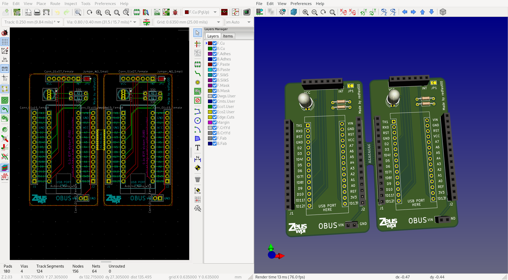

# OBUS PCB

In order to make it easier for our members to get started creating their own OBUS module,
we designed and ordered PCBs they can use instead of having to wire up the basics
on a breadboard. The PCB accomodates an Arduino Nano V3 (and clones), an MCP2515 CAN-bus module
and an RGB LED. The LED and CAN bus module are connected to pins on the
Arduino Nano. All pins on the Arduino Nano are connected to the ajacent pin socket so
they can easily be accessed when breadboarding.
The pins already used by the OBUS framework are marked with exclamation marks. This does
not mean they can't be used for other purposes anymore, just that you need to pay
attention when using them: for example the SPI pins can be used for other devices, but
the LED pins can't. While picking the pins, we made sure to use the least useful pins
for the OBUS framework: we tried to pick as few PWM pins as possible, didn't pick any I2C
pins, ...

## Connecting the parts on the socket.

We tried our best to make the board as self-explanatory as possible. When pushing the
Arduino into its socket, make sure it's in the correct orientation. When connecting the
CAN bus module, you'll need to flip it on its back, then look at the silk screen on both
the OBUS PCB and the CAN module so that the INT pin is connected in the INT socket hole.

By default, the INT pin on the CAN module is not connected to the Arduino in order to
save pins. If you want to connect the INT pin to pin D2 on the Arduino, you can bridge
the jumper on the top right of the board with some solder.

### Component list per board

- 2 1x15 2.54mm pin sockets, we recommend 4 sockets so you can socket the Arduino as well
- 1 1x07 2.54mm pin socket
- 1 1x02 2.54mm pin socket
- 1 common cathode 5mm RGB LED, pin order RCGB
- 2 330 ohm through hole resistors

## TODO for next board iteration

There is still some space left over at the top and sides of the board, so use it:

- Add extra connection holes for every Arduino pin where wires can be soldered semi permanently on the sides of the board
- Add copper pads/holes to make a "perfboard" on the bottom of the board (with 2.54mm spacing, like a breadboard)
- Add holes to solder wires in for the status RGB LED in case we don't want this on the main PCB
- Add silkscreen with pin names on back of PCB
- Add SMD footprints for LED resistors
- Add holes for M3 bolts
- Add logo on back
